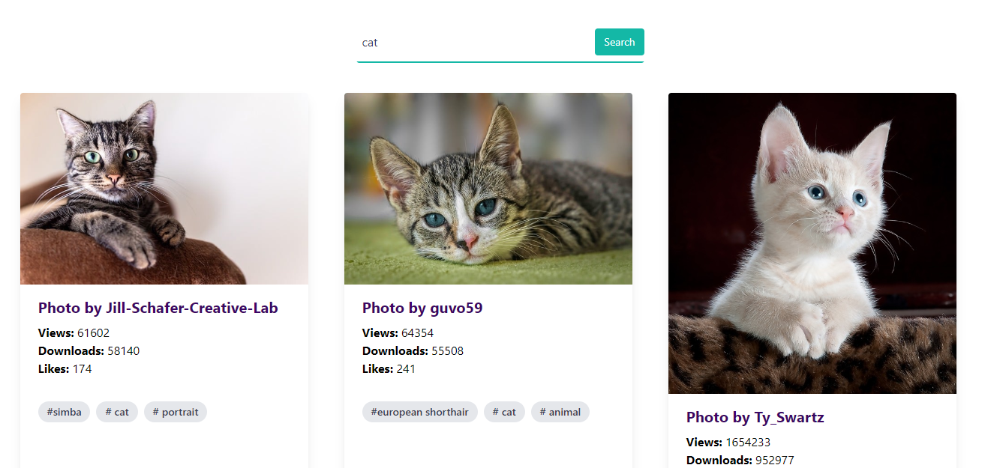
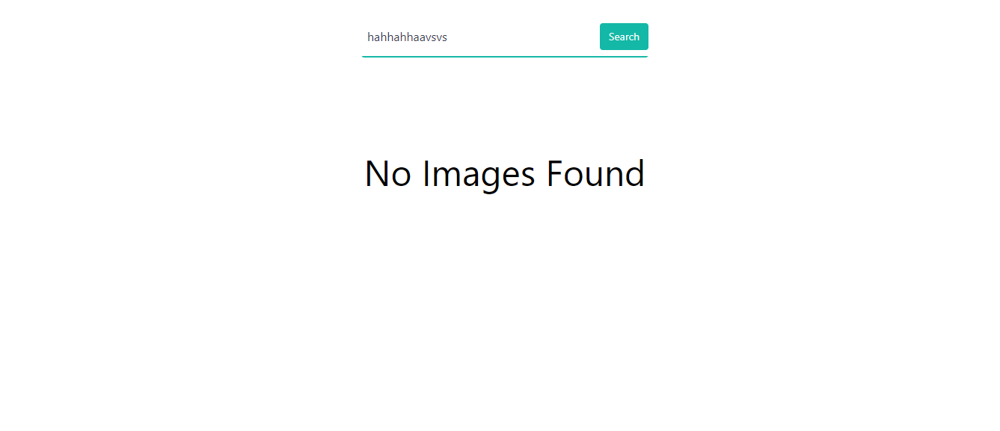

# Image-Gallery-React-Tailwind

This project is a responsive image gallery built with React and styled using Tailwind CSS. It fetches images from the Pixabay API and displays them in a clean and interactive grid layout. This project demonstrates the integration of Tailwind CSS with React and utilizes PostCSS and Autoprefixer to ensure compatibility across different browsers.

## Features

- **Responsive Design**: Optimized for various screen sizes using Tailwind CSS.
- **Pixabay API Integration**: Fetches and displays images from the Pixabay API.
- **Search Functionality**: Users can search for images by keywords. If a valid keyword is given, the images will be displayed; if the keyword is invalid, a "No images found" message will be shown.
- **Loading and Error Handling**: Displays loading indicators and error messages when necessary.
- **Modular Components**: Clean and reusable components for future extensions.

## Technologies Used

- **React**: JavaScript library for building user interfaces.
- **Tailwind CSS**: Utility-first CSS framework for styling.
- **Pixabay API**: Used for fetching high-quality images.
- **PostCSS**: For processing Tailwind CSS.
- **Autoprefixer**: Ensures CSS compatibility across different browsers.

## Screenshots

### Image Gallery

*This screenshot showcases the responsive image gallery displaying images fetched from the Pixabay API. Users can interact with the images seamlessly on various devices.*

### No Images Found Example

*This screenshot demonstrates the interface when no images are found based on the user's search query. A clear message informs the user that no results were returned for their input.*

